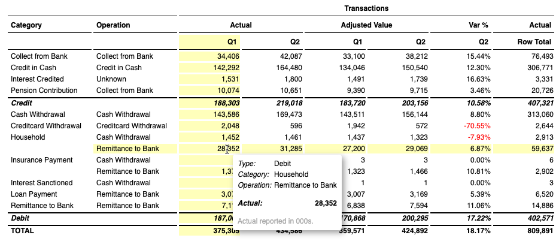
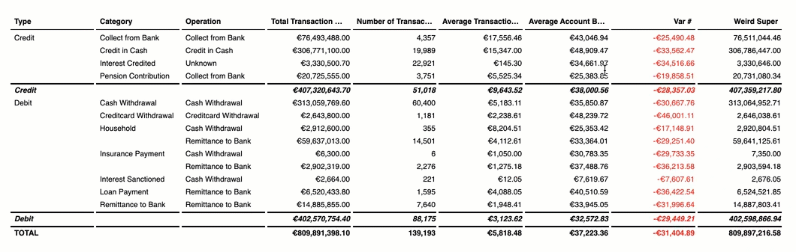
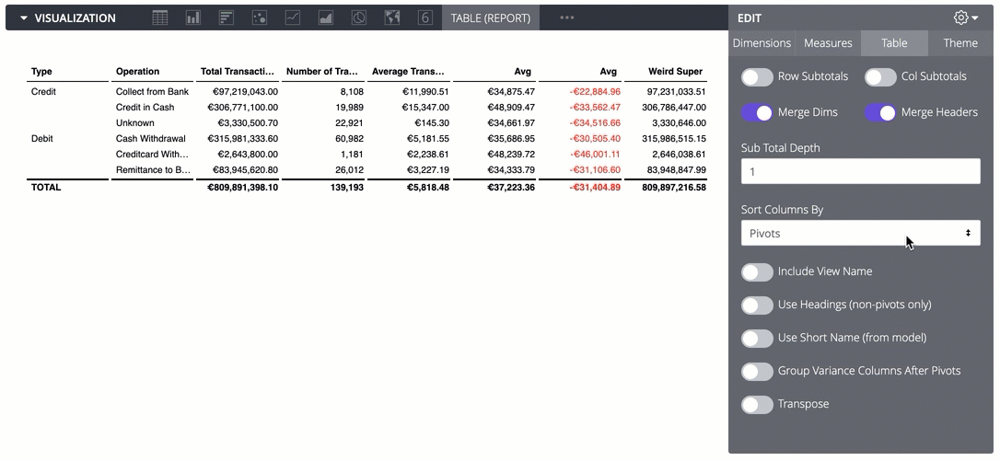
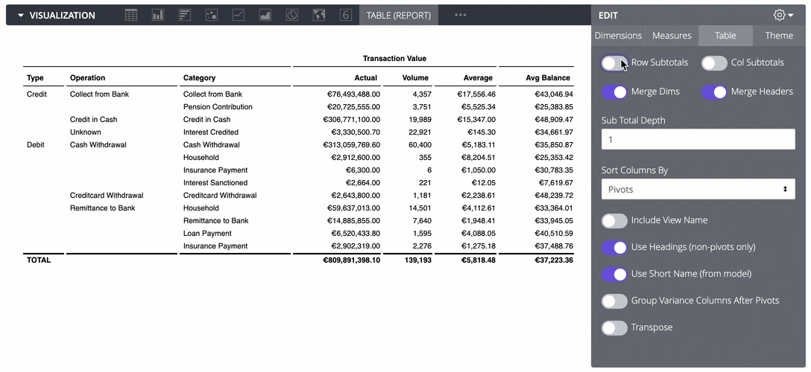
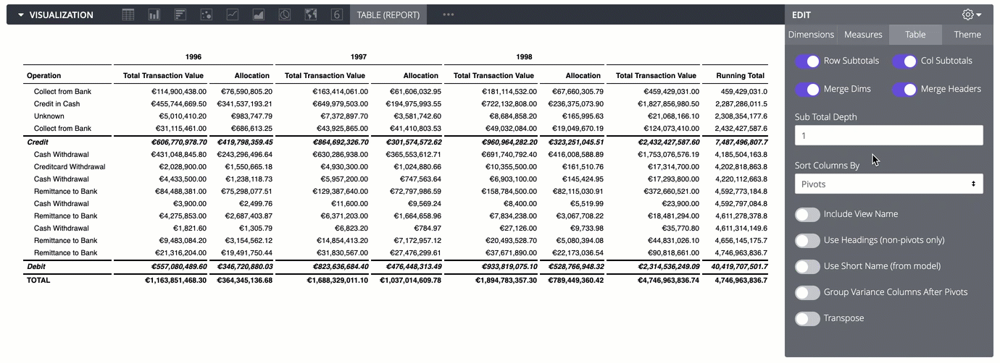
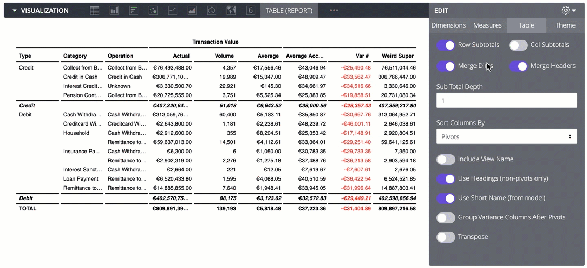
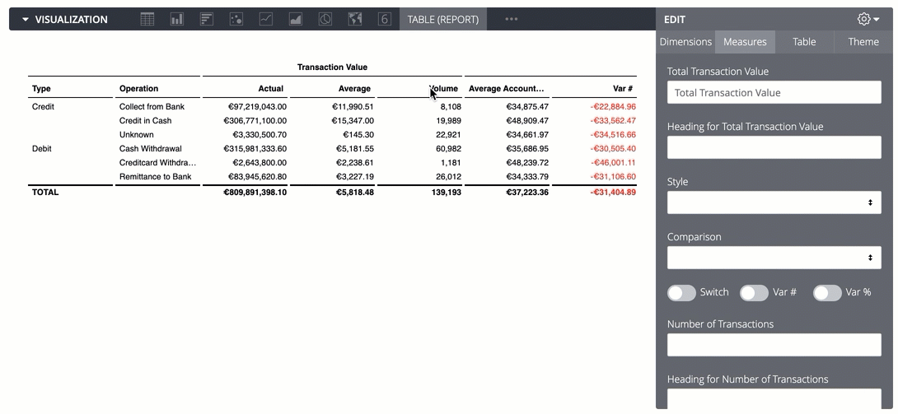

# Report Table for Looker

A table dedicated to single-page, enterprise summary reports. Useful for PDF
exports, report packs, finance reporting, etc. Does not do multi-page tables and
lists. Does look good for your year-on-year analysis. Originally created by [Jon
Walls](https://github.com/ContrastingSounds/vis-report_table).



- Quick variance calculations
- Add subtotals (including column subtotals for tables with two levels of pivot)

  - Subtotals taken from Looker subtotals if available, otherwise performed as
    front-end calculation

- Add a header row to non-pivoted tables
- Organise measure columns by pivot value, or by measure

  - Flat tables (i.e. no pivots) can be organised by drag'n'drop

- Transpose (any number of dimensions)
- Easy red/black conditional format
- "Subtotal" format e.g. for highlighting transposed rows of measures
- Themes, including ability to test custom themes using your own css file
- Use LookML tags to give default abbreviations to popular fields
- Reduce to a single dimension value for financial-style reporting
- Drill-to-detail

## Examples

_Drag'n'drop columns for flat tables_



_Tags in LookML for consistent headers and abbreviations_



_Subtotals and "show last dimension only"_



_Sort by Pivot or Measure_



_Set headers and labels_



_Even width columns or autolayout_


_Transposing and PnL style reports_



## Tagging fields in LookML

A common reporting requirement is grouping fields under headings, and
abbreviating column headers when many columns are present. This can be
repetitive work! The Report Table vis will pick up tags in the LookML model,
with the format `"vis-tools:SETTING:VALUE"`.

The current tag settings available are `heading`, `short_name`, `unit`.

    measure: number_of_transactions {
      tags: [
        "vis-tools:heading:Transaction Value",
        "vis-tools:short_name:Volume",
        "vis-tools:unit:#"
      ]
      type: count
      value_format_name: decimal_0
      drill_fields: [transaction_details*]
    }

## Notes

- Maximum of two pivot fields
- Subtotals calculated at the front end are only for simple sums & averages
  - e.g. no Count Distincts, running totals, measures of type "number" with
    arbitrary calculations
  - The vis will use subtotals from the query response if available
  - The tooltip will alert users to "estimated" numbers

## Using Custom CSS

You can also apply your own custom styling by supplying a URL to a CSS file in
the `Load custom CSS from:` option and selecting `Use custom theme` in the
`Theme` tab.


In order to serve raw CSS files from your git provider, first pass the URL
through [raw.githack.com](https://raw.githack.com/). Please use [this example
template](/src/theme_custom_template.css) to help you get started with your
customization.

## What if I find an error? Suggestions for improvements?

Great! Marketplace content -- including visualizations -- were designed for
continuous improvement through the help of the entire Looker community and we'd
love your input. To report an error or improvement recommendation, please get
in touch at help.looker.com to submit a request. Please be as detailed as
possible in your explanation and we'll address it as quick as we can.

### Interested in extending the visualization for your own use case?

#### Quickstart Dev Instructions

1.  **Install Dependecies.**

    Using yarn, install all dependencies

    ```shell
    yarn install
    ```

2.  **Make changes to the source code**

3.  **Compile your code**

    You need to bundle your code, let's run:

    ```shell
    yarn build
    ```

4.  **Building your code automatically in the background**

    Recommended: Webpack can detect changes and build automatically

    ```shell
    yarn watch
    ```

    Your compiled code can be found in this repo.

**`./report_table.js`**: This visualization's minified distribution file.

**`LICENSE`**: Looker's Marketplace content License file.

**`manifest.lkml`**: Looker's external dependencies configuration file. The visualization object is defined here.

**`marketplace.json`**: A JSON file containing information the marketplace installer uses to set up this project.

**`/src`**: This directory will contain all of the visualization's source code.

**`/src/report_table.js`**: The main source code for the visualization.

**`/node_modules`**: The directory where all of the modules of code that your project depends on (npm packages) are automatically installed.

**`README.md`**: This! A text file containing useful reference information about this visualization.

**`yarn.lock`**: [Yarn](https://yarnpkg.com/) is a package manager alternative to npm. This file serves essentially the same purpose as `package-lock.json`, just for a different package management system.

## Troubleshooting

### Build fails with an error code of `ERR_OSSL_EVP_UNSUPPORTED`

If you run into the following error when building using `yarn build`:

```shell
yarn run v1.22.19
$ webpack
node:internal/crypto/hash:71
this[kHandle] = new _Hash(algorithm, xofLen);
                ^

Error: error:0308010C:digital envelope routines::unsupported
  at new Hash (node:internal/crypto/hash:71:19)
  at Object.createHash (node:crypto:133:10)
  ...
  at FSReqCallback.readFileAfterClose [as oncomplete] (node:internal/fs/read_file_context:68:3) {
opensslErrorStack: [ 'error:03000086:digital envelope routines::initialization error' ],
library: 'digital envelope routines',
reason: 'unsupported',
code: 'ERR_OSSL_EVP_UNSUPPORTED'
}

Node.js v18.15.0
error Command failed with exit code 1.
info Visit https://yarnpkg.com/en/docs/cli/run for documentation about this command.
```

Use the following build command instead:

```shell
env NODE_OPTIONS="--openssl-legacy-provider" yarn build
```
