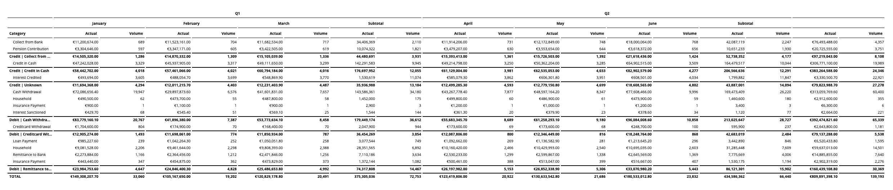

# Report Table for Looker

- Quick variance calculations
- Add subtotals (including column subtotals for)
- Add a header row to non-pivoted tables
- Organise pivot tables by pivot value, or by measure
- Easy red/black conditional format
- Use LookML tags to give default abbreviations to popular fields
- Reduce to a single dimension value for financial-style reporting
- Experimental: drag'n'drop ordering of flat tables

## Notes

- Maximum of two pivot fields
- Variances only possible against other measures
  - Future version will allow comparisons against same measure for different pivot values (eg Period-over-Period)
  - For period-over-period analysis currently, create separate measures in LookML or as custom measures

## Marketplace Installation

URL: git://github.com/ContrastingSounds/vis-report_table.git

SHA: 571bed7ec63e3d1ac724cad8d7cbde64a18037ad
