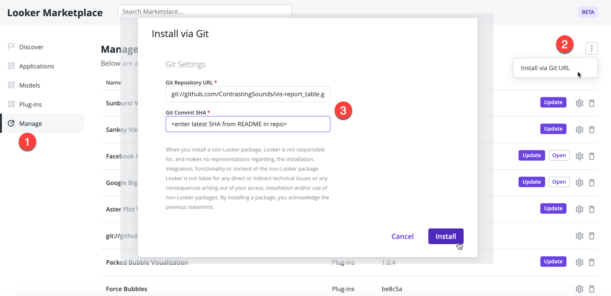

# Report Table for Looker

- Quick variance calculations
- Add subtotals (including column subtotals for tables with two levels of pivot)

  - Subtotals taken from Looker subtotals if available, otherwise performed as front-end calculation
- Add a header row to non-pivoted tables
- Organise measure columns by pivot value, or by measure

  - Flat tables (i.e. no pivots) can be organised by drag'n'drop
- Transpose (any number of dimensions)
- Easy red/black conditional format
- "Subtotal" format e.g. for highlighting transposed rows of measures
- Themes, including ability to test custom themes using your own css file
- Use LookML tags to give default abbreviations to popular fields
- Reduce to a single dimension value for financial-style reporting

## Examples

## Tagging fields in LookML

A common reporting requirement is grouping fields under headings, and abbreviating column headers when many columns are present. This can be repetitive work! The Report Table vis will pick up tags in the LookML model, with the format `"vis-tools:SETTING:VALUE"`.

The current tag settings available are `heading` and `short_name`.

    measure: number_of_transactions {
      tags: [
        "vis-tools:heading:Transaction Value",
        "vis-tools:short_name:Volume",
        "vis-tools:unit:#"
      ]
      type: count
      value_format_name: decimal_0
      drill_fields: [transaction_details*]
    }

## Notes

- Maximum of two pivot fields
- Subtotals calculated at the front end are only for simple sums & averages
  - e.g. no Count Distincts, running totals, measures of type "number" with arbitrary calculations
  - The vis will use subtotals from the query response if available

## Marketplace Installation

URL: git://github.com/ContrastingSounds/vis-report_table.git

SHA: fa79f97a08566b95e7d3daf247165a1786ed37e9

